## Desafio e-commerce
O desafio é criar um e-commece de um site de compras 

- Fazer parte de favoritos
- Fazer parte de escolher o modo de pagamento como um RadioButton sem precisar finalizar
- Exibir notas dos produtos de 0 a 5 podem colocar como quantidade de estrelas (imagem)
- Exibir comentários das avaliações dos produtos (alguns comentários por produto)
- Adicionar filtro de faixa de preço
- Inserir opção de cor nos produtos
- Colocar opção de visualização como lista (feita) e como grade - usar como base a loja
americana que tem os dois tipos de visulização
- Bonus 1: (fazer editar, apagar e criar endereço)
- Bonus 2: (nas funções de editar, apagar e criar endereço fazer como um modal)

## Techs 
- React JS
- JS
- HTML
- CSS

## Instalações
Para que o program rode com perfeição no Visual Studio Code é necessário fazer as instalações abaixo
- instalar o node na sua máquina e depois fazer as instalações abaixo no terminal
- node-v
- react-router-dom
- react-redux
- @reduxjs/toolkit
- Extensão Redux DevTools
- sass-loader
- @node-sass

## Funcionamento da Página 
  
- Página inicial 
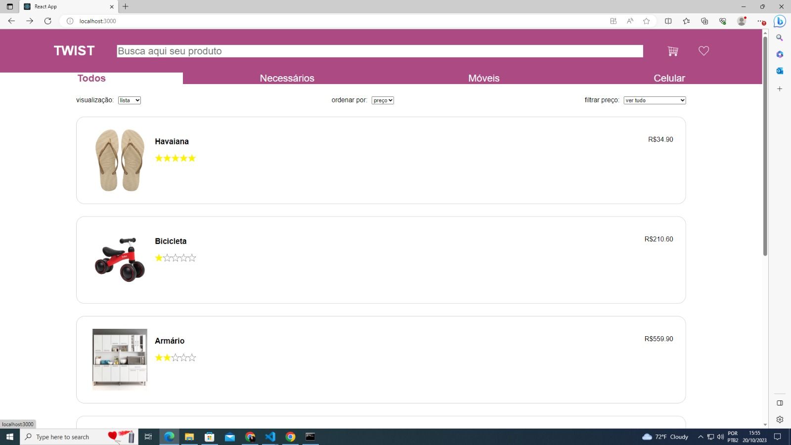

- Opção para ordenar os produtos em lista ou grade
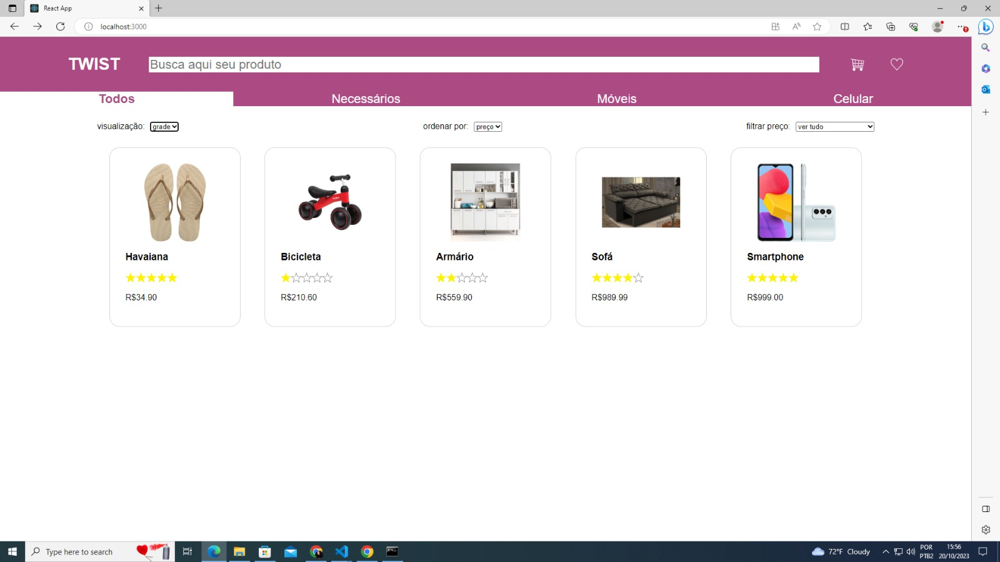

- Opção para ordenar os produtos por ordem de valores ou alfabética
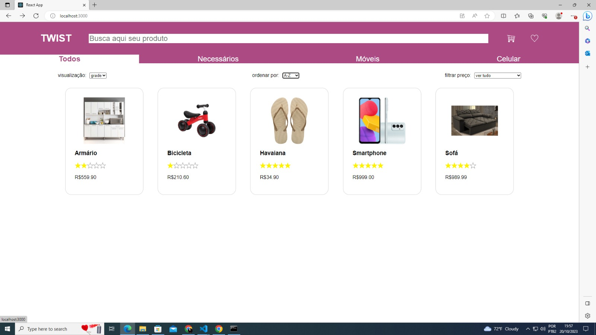

- Filtros de apresentar os produtos por faixa de valores 
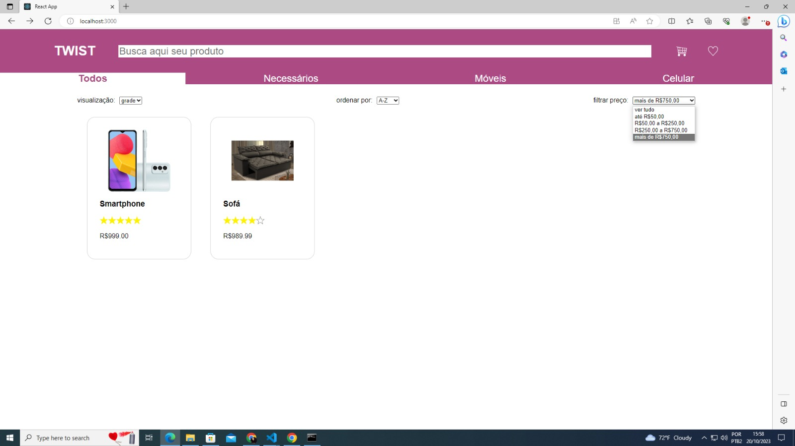

- Buscar os produtos por categoria  
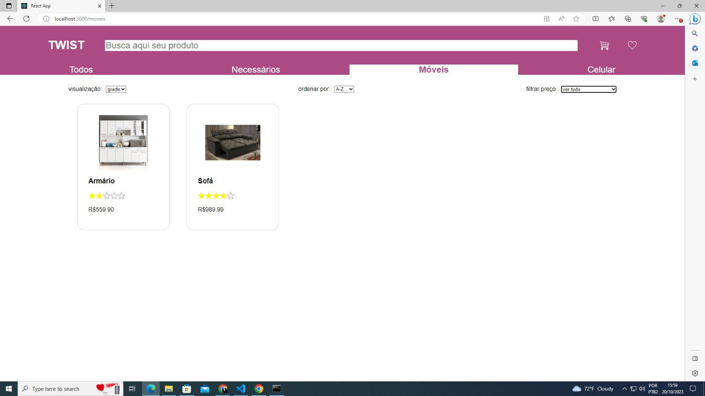

- Opção de comprar por quantidade e cor do produto
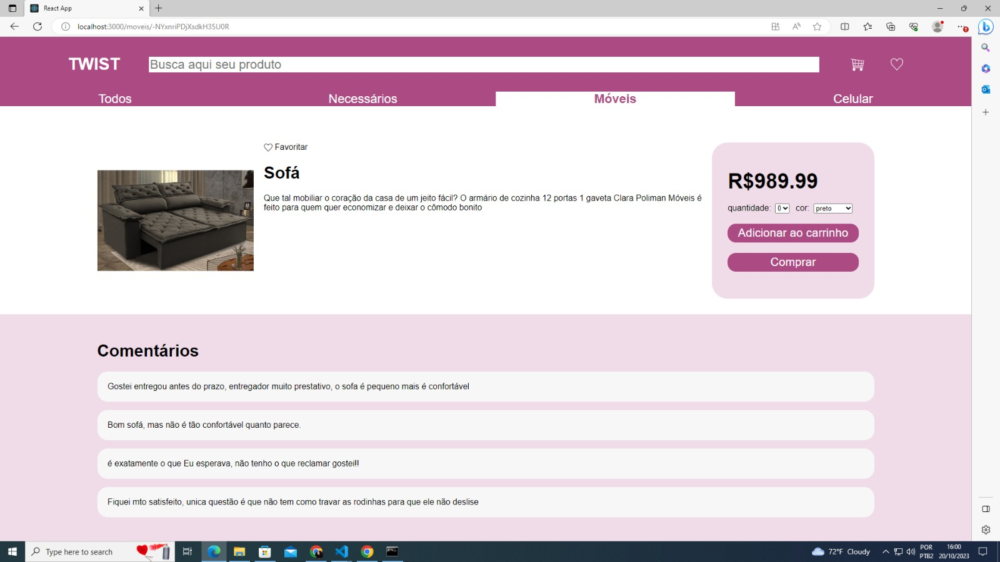

- Carrinho 
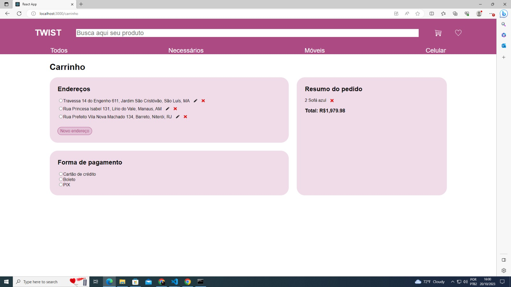

- Opção de adicionar um endereço 
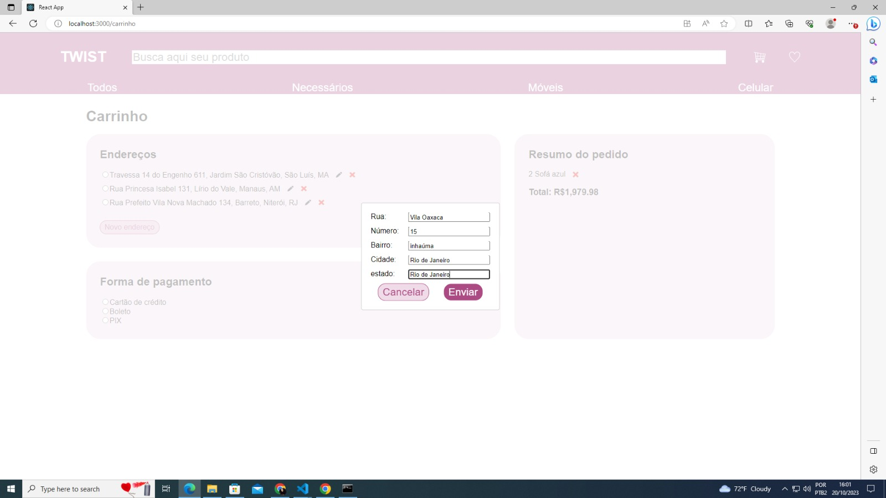

- Opções de escolha de forma de pagamento
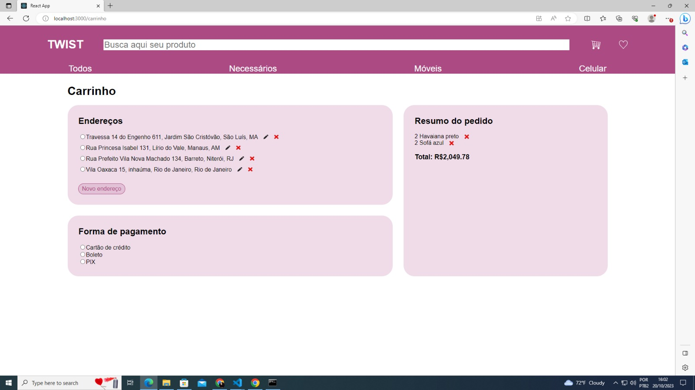

- Opção de favoritar produto 
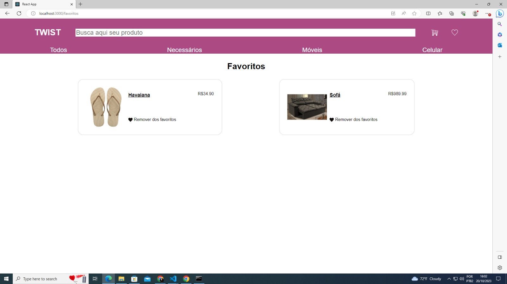

- Opção de pesquisar produtos por nome
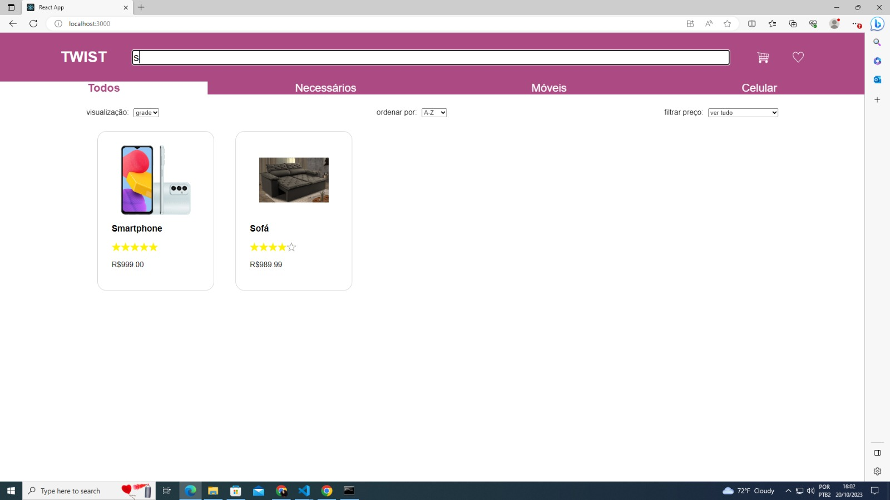

